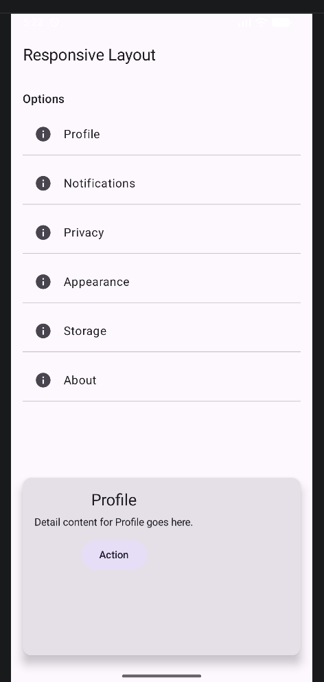
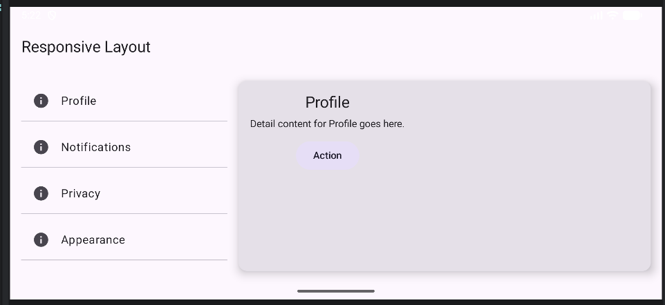

# Q4 – Responsive Layout (Phone vs Tablet)

This screen adapts its layout based on available width.

On narrow screens (phone), the UI uses a single `Column` layout:
- A  `LazyColumn` displays the options list.
- A detail card is shown below the list.

On wide screens (tablet/landscape), the layout switches to a two-pane `Row`:
- Left pane: a  options list.
- Right pane: a detail card showing the selected item.

Responsive behavior is implemented using `LocalConfiguration` to check screen width.  
`weight()` is used to allocate space between panes in wide mode.

## AI Usage

ChatGPT was used for debugging layout issues and helping refine the responsive structure. It is also used to draft this README.

## Screenshot

